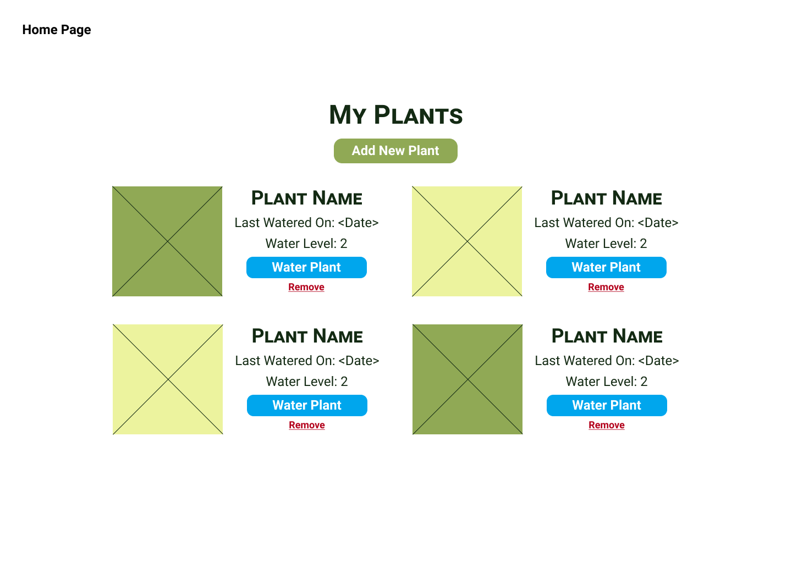
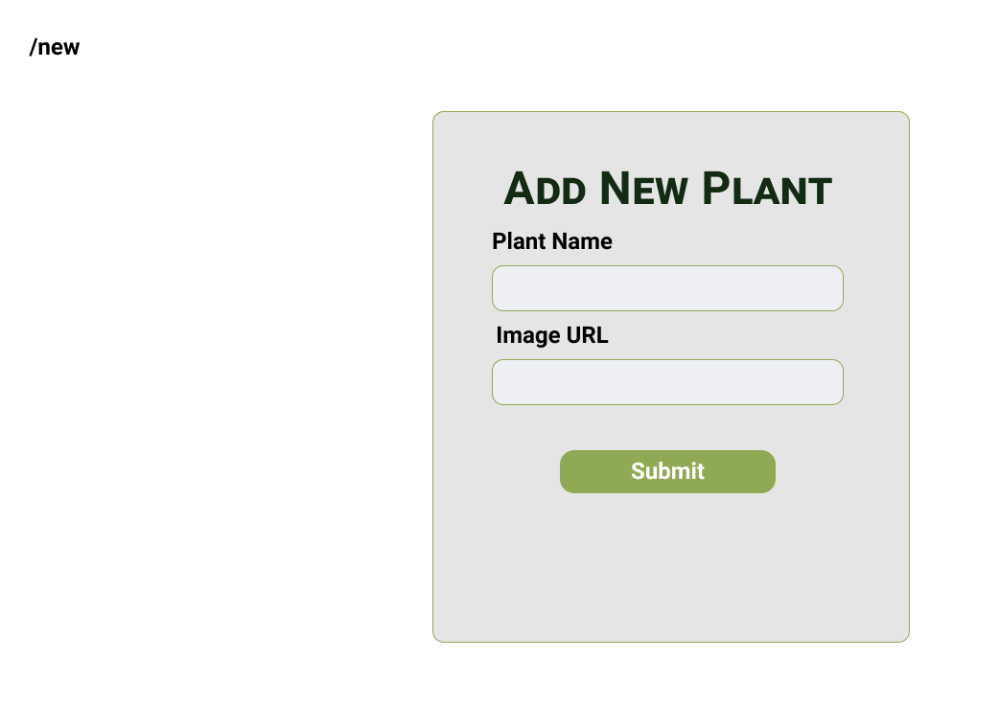

# Plant Watering App Planning Document
## Wireframes
### Home Page

### Add New


### Data Model
Name|Data Type| Default
-----|-----|---
id | Integer(Number) | Increment
name| String | None
lastWatered| Date | None
maxWaterLevel| Integer (Number)| 5
currentWaterLevel| Integer (Number) | 0
imageURL|String|None

<br>
Sample Plant Object:

```javascript
{
    id: 1,
    name: "Larkspur",
    lastWatered: new Date(),
    maxWaterLevel: 5,
    currentWaterLevel: 0,
    imageURL: "https://imagesvc.meredithcorp.io/v3/mm/image?url=https%3A%2F%2Fstatic.onecms.io%2Fwp-content%2Fuploads%2Fsites%2F37%2F2020%2F03%2Fblue-larkspur-consolida-469d396f.jpg",

}
```

### Events
1. On load
   * Check if there are any plants in local storage, if not, load the seed data
2. On click -- "Add New Plant" -- can just be a normal link to `/new`
3. On click -- "Remove plant"
3. On submit -- Plant Form
   * Add plant to local storage with defaults for waterLevel

### Backlog
Note: These are simply in a list form right now, but you may want to create Github issues for more detailed tracking.
#### Seed Data
- [ ] Create and export an array of plant objects to be loaded into local storage when the page loads -- save as plants
- [ ] Write a function called `loadData` that first checks if there is any data in local storage -- if there is data, do nothing, if there's no data, load the seed data
- [ ] local storage key will be `PLANTS`
- [ ] create utils.js functions:
    * getPlantById: returns plant with specific ID from localStorage
    * getPlants: returns array of plants from localStorage

### Home Page
- [ ] Loop through each plant in local storage and display the plant information (do not worry about wiring up the click events -- just focus on the display)
- [ ] Write a function for the "Water Plant" event listener
   * function name: `waterPlant`
   * accepts an ID as parameter
   * increments the waterLevel for the associated ID
   * updates the lastWatered date with the current timestamp
- [ ] Write a function for the "Remove" event listenter
   * function name: `removePlant`
   * accepts an ID as parameter
   * removes the associated plant from local storage
- [ ] Wire up the event listeners

### Add New
- [ ] Create the HTML form including inputs for plant name and image url and a submit button
- [ ] Create a function for the submit event listener
   * functionName: `addNewPlant`
   * retrieves the user input from the form
   * adds a new plant to local storage
- [ ] Wire up the submit button to call `addNewPlant` and then redirect back to the homepage

### Bonus Features
- [ ] Display if the plant is over or under watered -- over watered is if its over the maxWaterLevel, under watered is if the level is below 2
- [ ] Allow users to edit plants (update their name or image URL)